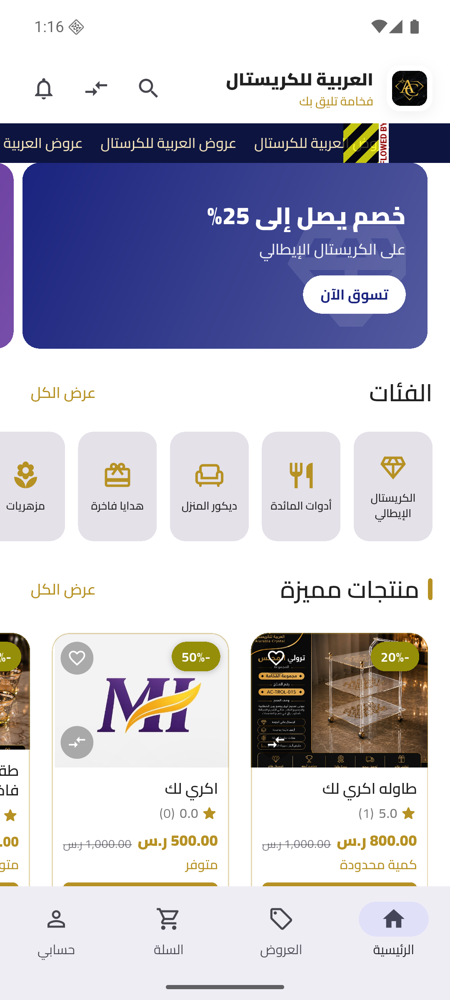
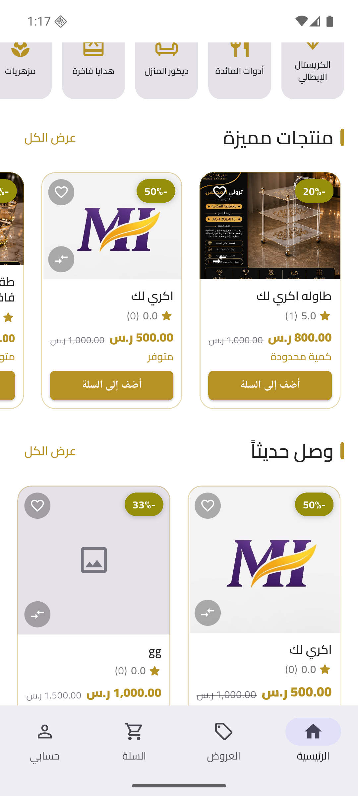
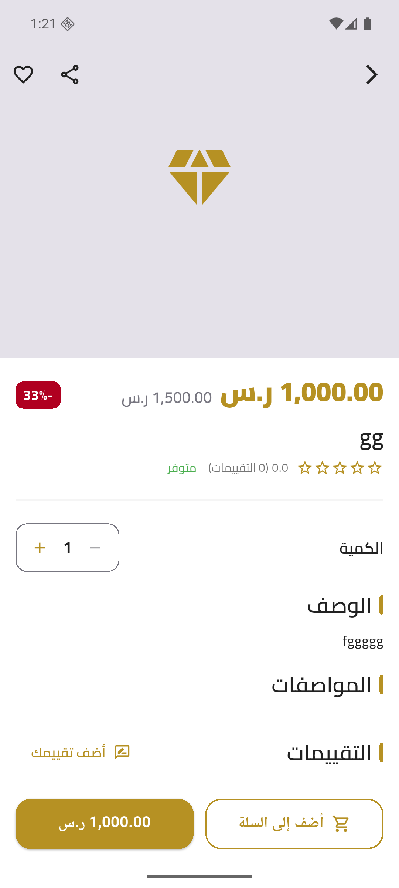

# 💎 العربية للكريستال (Alarabi Crystal)

> **فخامة تليق بك** — تطبيق متجر إلكتروني متكامل لبيع منتجات الكريستال الفاخرة، مبني بـ Flutter و Firebase، مع خادم Backend موثوق (Trusted Backend) منفصل على Vercel لحماية منطق الطلبات والأسعار من التلاعب.

---

## 📱 لقطات من التطبيق

| الرئيسية | المنتجات والفئات | تفاصيل المنتج |
|:---:|:---:|:---:|
|  |  |  |

---

## ✨ مميزات التطبيق

### للعميل
- **تصفح وبحث ذكي** في المنتجات مع فلترة حسب الفئة (مزهريات، هدايا فاخرة، ديكور المنزل، أدوات المائدة، الكريستال الإيطالي...).
- **بطاقات منتجات** تعرض السعر قبل وبعد الخصم، نسبة الخصم، حالة التوفر، والتقييم بالنجوم.
- **سلة تسوق** كاملة مع تعديل الكميات، وحساب المجموع تلقائياً.
- **دفع/طلب آمن عبر الخادم الموثوق**: عملية إنشاء الطلب (السعر، المخزون، الكوبونات) تُحسب بالكامل على الخادم لا داخل التطبيق، لمنع أي تلاعب بالأسعار من طرف العميل.
- **نظام كوبونات خصم** يدعم استهدافاً محدداً لفئات معينة من المستخدمين.
- **عروض تُطبَّق تلقائياً** على المنتجات المؤهلة دون الحاجة لكود.
- **نقاط ولاء (Loyalty Points)** تُكتسب مع كل عملية شراء.
- **تقييمات ومراجعات المنتجات** من المستخدمين.
- **إشعارات فورية (Push) وداخل التطبيق** لآخر العروض وتحديثات الطلب.
- **تتبع حالة الطلب لحظياً** (قيد الانتظار، قيد التجهيز، تم الشحن...).
- **طباعة/تصدير فاتورة الطلب** بصيغة PDF.
- **طلبات استرجاع (Refunds)** ودردشة دعم مباشرة مع الإدارة.

### للإدارة (لوحة تحكم مخصصة داخل التطبيق)
- إدارة المنتجات (إضافة/تعديل/حذف، الكميات، الصور، الفئات).
- إدارة الطلبات ومتابعة حالتها.
- إدارة الكوبونات والعروض.
- إدارة طلبات الاسترجاع.
- الرد على محادثات الدعم الفني مع العملاء.
- إرسال إشعارات مستهدفة لجمهور محدد أو لكل المستخدمين.

---

## 🏗️ البنية التقنية

```
Flutter (Clean Architecture: data / domain / presentation)
        │
        ├── Firebase Auth        → المصادقة
        ├── Cloud Firestore      → قاعدة البيانات (قراءة مباشرة + مستمعات لحظية)
        ├── Firebase Messaging   → الإشعارات
        ├── Firebase App Check   → حماية الوصول للـ Backend من تطبيقات مزيفة
        │
        └── Trusted Backend (Vercel Serverless, Node.js)
                ├── /api/order   → إنشاء الطلبات (تحقق من السعر/المخزون/الكوبون بأمان)
                ├── /api/review  → إضافة التقييمات
                └── /api/notify  → إرسال الإشعارات
```

نظراً لاستخدام خطة Firebase المجانية (Spark) التي لا تدعم Cloud Functions، تم بناء خادم Backend صغير خارجي (بدون أي اعتماديات تقريباً) يتحقق من توقيع Firebase لكل طلب، ويُنفّذ العمليات الحسّاسة (حساب السعر، خصم المخزون، استهلاك الكوبون) بشكل ذرّي (Firestore Transactions) لمنع التلاعب أو التعارض عند الطلبات المتزامنة.

## 🔒 الأمان

خضع المشروع لمراجعة أمنية شاملة (تدقيق كامل لقواعد Firestore، مسارات الـ API، الصلاحيات، ومنطق الأعمال) تلاها تطبيق تحصينات فعلية:
- إزالة أي سرّ ثابت كان مضمَّناً داخل تطبيق العميل، والاعتماد بدلاً منه على التحقق من هوية Firebase الموقّعة على مستوى الخادم.
- تحديد معدل الطلبات (Rate Limiting) على مسارات الـ API الحساسة.
- حدّ أقصى لعدد الطلبات "قيد الانتظار" لكل مستخدم لمنع إغراق النظام.
- حدود (`limit`) على كل الاستعلامات والمستمعات اللحظية في Firestore لمنع تحميل بيانات غير محدودة.
- تفعيل Firebase App Check لتقليل إمكانية الوصول للـ Backend من مصادر غير موثوقة.

## 🛠️ التقنيات المستخدمة

- **Flutter** (Dart) — `flutter_bloc`, `go_router`, `get_it`, `dio`, `hive`
- **Firebase** — Auth, Cloud Firestore, Messaging, App Check
- **Vercel Serverless Functions** (Node.js) — خادم Backend موثوق
- **printing / pdf** — تصدير فواتير PDF
